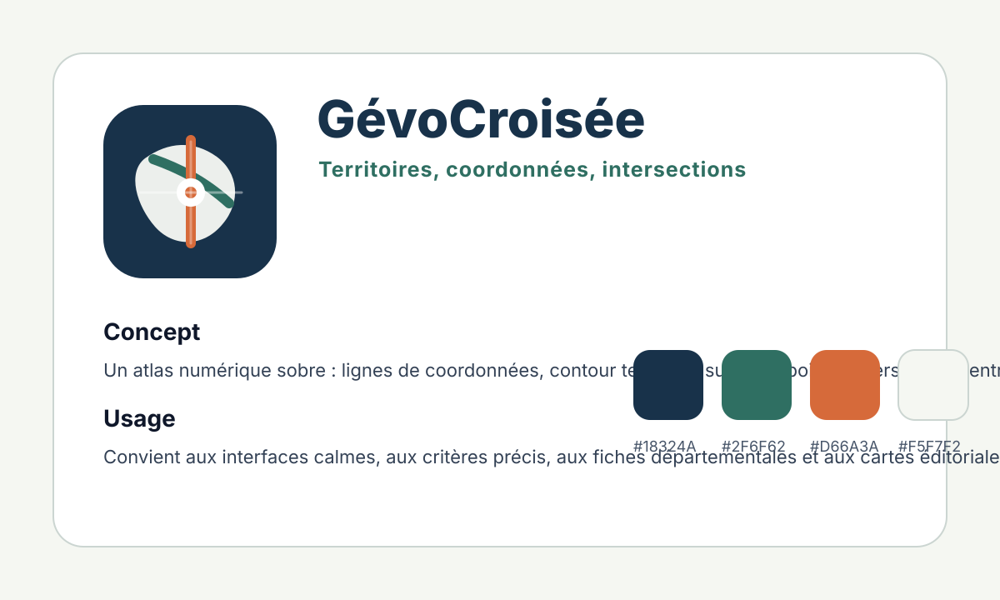
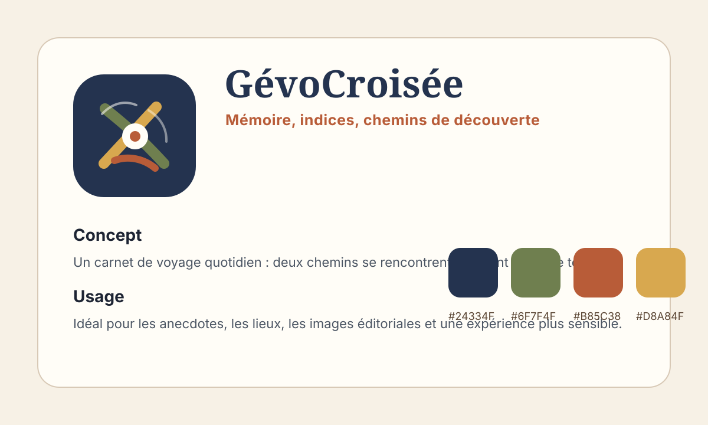
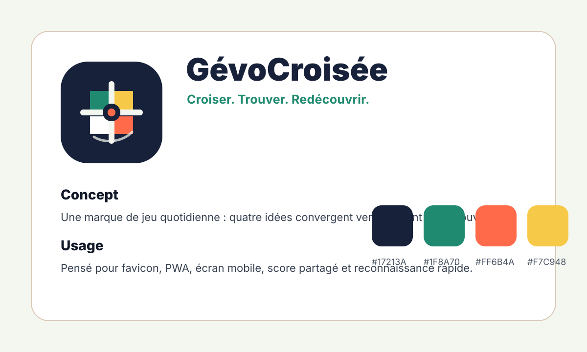
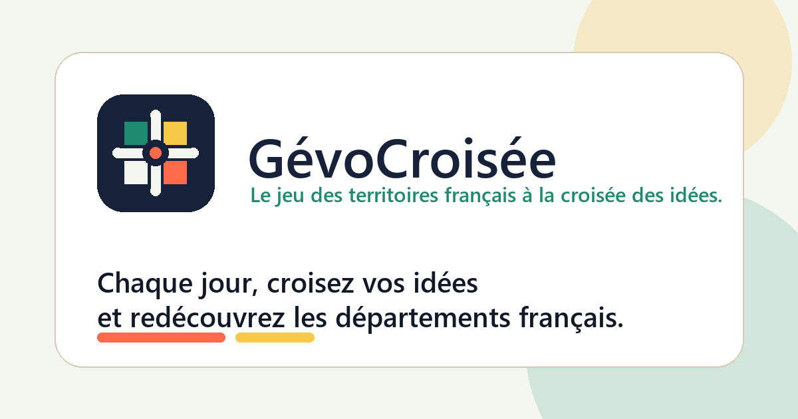

# Phase 21 - Implementation preparatoire de l'identite visuelle GevoCroisee

## Perimetre

Cette phase met en place une premiere structure d'assets visuels `GévoCroisée` conforme au `brand_book_phase_20.md`, sans basculer l'application dessus.

Aucun fichier applicatif n'a ete modifie. Les assets existants n'ont pas ete supprimes, remplaces ni dereferences.

Hors perimetre confirme :

- gameplay ;
- donnees departementales ;
- anecdotes ;
- regles ;
- collections ;
- rarete ;
- scoring ;
- logique metier.

## 1. Inventaire des assets actuellement utilises

| Surface active | Fichier / reference actuelle | Statut |
|---|---|---|
| Manifest PWA | `index.html` -> `/site.webmanifest` | Actif |
| Theme color navigateur | `index.html` -> `#273a5c` | Actif, ancienne palette |
| Favicon SVG | `index.html` -> `/icons/gevocroisee-icon.svg` | Actif, asset renomme mais herite de l'icone GeoDoku |
| Favicon PNG | `index.html` -> `/icons/favicon-32.png` | Actif, asset existant conserve |
| Apple touch icon | `index.html` -> `/icons/apple-touch-icon.png` | Actif, asset existant conserve |
| Icone PWA 192 | `public/site.webmanifest` -> `/icons/gevocroisee-icon-192.png` | Actif, asset existant conserve |
| Icone PWA 512 | `public/site.webmanifest` -> `/icons/gevocroisee-icon-512.png` | Actif, asset existant conserve |
| Logo en-tete | `src/main.jsx` + `src/styles.css` | Actif, pictogramme `Map` Lucide dans un carre bleu |
| OpenGraph image | Non declaree | Absente |
| Twitter/X card image | Non declaree | Absente |

Constat : les surfaces publiques actives restent celles issues des phases precedentes. La nouvelle identite creee en phase 21 est disponible dans un dossier dedie, mais elle n'est pas encore raccordee a `index.html`, au manifest ou au header applicatif.

## 2. Structure d'assets creee

Nouveau dossier :

`public/brand/phase21/`

### Assets finaux recommandes

| Asset | Fichier | Format | Dimensions | Role |
|---|---|---:|---:|---|
| Logo principal | `public/brand/phase21/gevocroisee-logo.svg` | SVG | 960 x 240 | Logo horizontal avec symbole + nom + sous-titre |
| Favicon source | `public/brand/phase21/gevocroisee-favicon.svg` | SVG | 64 x 64 | Source favicon symbole seul |
| Favicon PNG | `public/brand/phase21/gevocroisee-favicon-32.png` | PNG | 32 x 32 | Export navigateur |
| Icone PWA source | `public/brand/phase21/gevocroisee-pwa-icon.svg` | SVG | 512 x 512 | Source Android/iOS/PWA |
| Icone PWA 192 | `public/brand/phase21/gevocroisee-pwa-192.png` | PNG | 192 x 192 | Export PWA |
| Icone PWA 512 | `public/brand/phase21/gevocroisee-pwa-512.png` | PNG | 512 x 512 | Export PWA haute definition |
| Image OpenGraph source | `public/brand/phase21/gevocroisee-opengraph.svg` | SVG | 1200 x 630 | Source visuel social |
| Image OpenGraph PNG | `public/brand/phase21/gevocroisee-opengraph.png` | PNG | 1200 x 630 | Export OpenGraph/Twitter/X |

### Planches de concepts

| Concept | Fichier | Format | Dimensions |
|---|---|---:|---:|
| Concept A | `public/brand/phase21/concepts/concept-a.svg` | SVG | 1200 x 720 |
| Concept B | `public/brand/phase21/concepts/concept-b.svg` | SVG | 1200 x 720 |
| Concept C | `public/brand/phase21/concepts/concept-c.svg` | SVG | 1200 x 720 |

## 3. Concepts graphiques produits

### Concept A - Cartographique institutionnel moderne

Description : une direction sobre, precise et cartographique. Le signe repose sur un contour territorial simplifie, deux axes de coordonnees et un point d'intersection central.

Palette :

- primaire : `#18324A`
- secondaire : `#2F6F62`
- accent : `#D66A3A`
- fond : `#F5F7F2`
- ligne : `#CBD5D1`

Symbolique :

- carte ;
- coordonnees ;
- fiabilite ;
- croisement de criteres ;
- territoire interprete.

Adaptation favicon/PWA : bonne lisibilite si le contour reste tres simplifie. Risque principal : une perception trop institutionnelle ou trop proche d'un service cartographique.

### Concept B - Evocation patrimoine decouverte

Description : une direction plus sensible, construite autour de chemins, de traces et d'un point de decouverte. Elle evoque un carnet de territoire et donne davantage de chaleur editoriale.

Palette :

- primaire : `#24334F`
- secondaire : `#6F7F4F`
- accent terre : `#B85C38`
- accent ocre : `#D8A84F`
- fond : `#F7F1E6`

Symbolique :

- chemins qui se croisent ;
- memoire ;
- patrimoine ;
- exploration ;
- rencontre d'indices.

Adaptation favicon/PWA : possible, mais le signe devient plus narratif et moins immediat en tres petit format. Risque de perdre la force mobile-first.

### Concept C - Jeu moderne mobile-first

Description : une direction compacte, lisible et memorisable. Quatre tuiles representent les idees ou criteres qui convergent vers une croisee centrale. Le point corail marque la decouverte.

Palette :

- bleu nuit de marque : `#17213A`
- vert croisee : `#1F8A70`
- corail signal : `#FF6B4A`
- jaune partage : `#F7C948`
- fond clair : `#F4F6F0`
- texte : `#111827`

Symbolique :

- quatre idees ;
- croisement ;
- decision ;
- decouverte ;
- jeu quotidien ;
- partage mobile.

Adaptation favicon/PWA : tres bonne. Le symbole reste lisible en 32 px, fonctionne sans texte et peut etre exporte proprement en 192 px, 512 px et OpenGraph.

## 4. Concept final recommande

Concept recommande : **Concept C - Jeu moderne mobile-first**.

Raisons :

- c'est le plus distinctif par rapport a l'heritage GeoDoku ;
- il traduit directement l'idee de croiser plusieurs criteres ;
- il fonctionne en favicon, PWA, header mobile et partage social ;
- il garde une base territoriale sans dependre d'une carte detaillee ;
- il reprend la recommandation du brand book : marque memorisable, mobile-first, avec indices cartographiques et chaleur editoriale en soutien.

Le concept C doit devenir la base des assets de marque. Les concepts A et B peuvent rester utiles comme references secondaires :

- A pour la rigueur des grilles, criteres et elements cartographiques ;
- B pour les illustrations departementales, les anecdotes et les visuels editoriaux.

## 5. Apercu de l'identite proposee

### Logo principal

### Favicon / PWA

### OpenGraph

## 6. Fichiers ajoutes

- `public/brand/phase21/concepts/concept-a.svg`
- `public/brand/phase21/concepts/concept-b.svg`
- `public/brand/phase21/concepts/concept-c.svg`
- `public/brand/phase21/gevocroisee-logo.svg`
- `public/brand/phase21/gevocroisee-favicon.svg`
- `public/brand/phase21/gevocroisee-favicon-32.png`
- `public/brand/phase21/gevocroisee-pwa-icon.svg`
- `public/brand/phase21/gevocroisee-pwa-192.png`
- `public/brand/phase21/gevocroisee-pwa-512.png`
- `public/brand/phase21/gevocroisee-opengraph.svg`
- `public/brand/phase21/gevocroisee-opengraph.png`
- `product_phase_21.md`

## 7. Points d'attention avant integration active

Avant de raccorder ces assets a l'application, il faudra :

1. valider le concept C visuellement en contexte desktop et mobile ;
2. tester le favicon en 16 px, 32 px et onglet navigateur ;
3. tester l'icone PWA sur fonds Android/iOS avec masques arrondis ;
4. verifier le rendu OpenGraph dans un simulateur de carte sociale ;
5. decider si le header applicatif remplace le pictogramme Lucide par le nouveau symbole ;
6. mettre a jour `index.html` et `public/site.webmanifest` uniquement apres validation ;
7. documenter la source de generation des PNG si la charte est adoptee.

## 8. Confirmation de non-remplacement

Les anciens assets sont conserves. Les references actives de `index.html`, `public/site.webmanifest`, `src/main.jsx` et `src/styles.css` n'ont pas ete modifiees.

La phase 21 ajoute une proposition d'identite exploitable dans `public/brand/phase21/`, mais ne l'active pas encore dans l'application.
